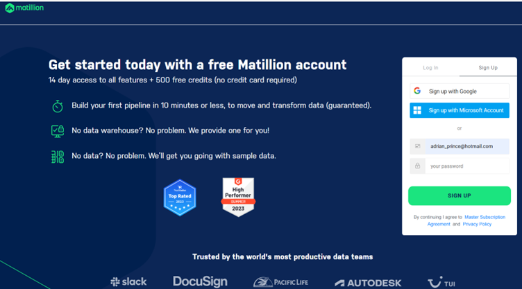
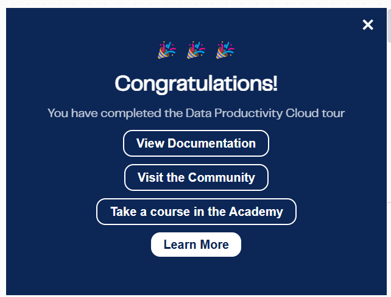

# How To Guide:

## For creating a Matillion account

Prior to starting, make sure that the email program you use is available, this will be required in the setting up of your account.  

You will also need to know your Matillion use cases and your Cloud Data Platforms, if any.  

The options available for each are detailed in the appropriate part of these instructions below.  

Go to the URL for the Matillion hub: hub.matillion.com/register and the following will be displayed.
 

Enter your email address in the email field, this will need to be an email that has not been used with Matillion previously.
 

Enter a password in the password field, note that the following popup appears to make sure the password complies with Matillion password standards.
 

When your password complies with the above, the popup screen will disappear, note that the password needs to be at least 8 characters and comply with at least 3 of the 4 other requirements.
Click on 'SIGN UP' and the following screen will be displayed.
 

Go to your email program and look for the following email from Matillion:
 

Click on the 'Activate account' button and the following page will open up in your default browser, note that this is the first stage of three stages.
 

Select your use case(s) from the following drop-down.
 

Select your Cloud Data Platforms, if any.
 

Once your information is completed for the two fields click on the .Continue' button and the following screen will appear, this is a continuation of the 'Create your Profile' section of setting your account up. 
 

Note that if you leave any of the mandatory fields blank you will be prompted to complete them, as per the following.
 

The optional phone number field, if populated, is validated as follows,
 

Populate all the mandatory fields and click on the 'Continue' button and the following screen will be displayed, note that this is now the second part of the setup process.
 

Choose your account location. UK is classified as EU for these purposes and click on Continue to display the next field.
 

It is important that at this stage that you choose the following option, which is the default already selected 'Use a Matillion trial warehouse' and click the 'Continue' button to take you to the following page, note the comment on the page that this page will be displayed whilst the trial warehouse is being set up. The screen in the middle of the page is an animated graphic.
 

Once completed, the following message will be displayed, note that in the background the Matillion home page is displayed.
 

Click on 'Take a Tour' and the following page is displayed explaining the Pipelines panel.
 

Click on the 'Next' button and the following is displayed explaining the Start component.
 

Again, click on the 'Next' button and the following message is displayed.
 

Click on the Plus icon indicated   and the following  screen is displayed.
 

Select a connector to connect, note that there is a scroll bar on the right so that all component options are available. It is also possible to use the search field or the filter buttons to limit choices. As the connector is chosen the following screen is displayed. In this instance I had chosen an Excel Query as the connector, if something else is chosen the options displayed may vary.
 

Click on the 'Next' button and the following is displayed highlighting how to validate and run the pipeline.
 

Click on the 'Next' button to get the following.
 

Click on the 'Next' button to get the following to show options available to you at this point
 

Each of the buttons on the screen ('View Documentation', 'Visit the Community', 'Take a course in the Academy' and 'Learn More') is clickable to take you to a relevant section of Matillion documentation.

Click on the 'Learn More' button to get the following.
 

Each of the above buttons and associated text are clickable to take you to the relevant section of the Matillion documentation that will open in a new browser window.
Once you are happy with the appropriate information provided via this page click on the cross in the top right corner to go to your Matillion homepage, as shown below.
 

You are now ready to start to use Matillion in earnest.